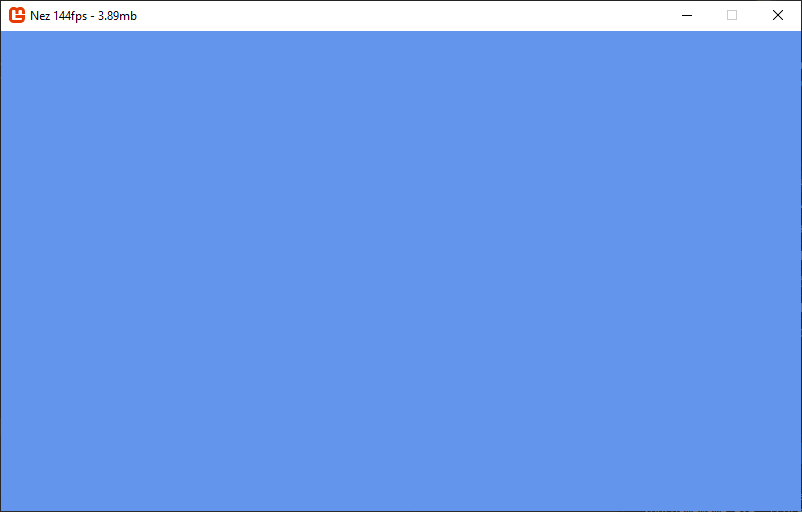

### You will need

- [Git](https://git-scm.com/) (or from your system package manager)
- [Dotnet commandline tool](https://dotnet.microsoft.com/download) (Core for the commandline, .net for
the runtime)
- Any text editor of your choice.

This tutorial will show you how to make your own .Net Core 3.1 Monogame game with Nez.

?> For this document, anywhere you see `NezExample` you can substitute with your games name.

----

### <small>1.</small> Solution File & Git

```bash
$ mkdir NezExample
$ cd NezExample
$ dotnet new solution
$ git init
```

The solution file holds a reference to all your related C# Projects, and we initialize
a git repo to have a nice and safe VCS.

----

### <small>2.</small> Add Nez & Your Game

```bash
$ git submodule add --branch py-2.0 https://github.com/JonSnowbd/Nez.git
$ mkdir GameSource
$ cd GameSource
$ dotnet new console # Creates a .net core 3.1 console application.
```

And then we add Nez by adding it as a submodule. What this means is that it is stored as
a pointer to the actual git project, making it super easy to update nez down the line!

Think of it as adding an image via a url, versus actually uploading an image.

Next up we should register everything we're going to use from Nez into our solution file.
Nez is broken up into several project files, each with their own purposes.
We're going to use Monogame, so we don't use any with `.FNA` in it. And we're using
.Net Core 3.1, so we want the `.Standard` project files.

And we need 2 specific projects from nez; The Portable library(Nez.Portable),
and a Scene implementation(Nez.DefaultEC).

```bash
$ cd .. # Back up to NezExample/
$ dotnet sln add Nez/Nez.Portable/Nez.Standard.csproj
$ dotnet sln add Nez/Nez.DefaultEC/Nez.DefaultEC.Standard.csproj
# And lets not forget our game itself!
$ dotnet sln add GameSource/GameSource.csproj
```

As you can see, like with the solution file, `dotnet new console` created our .csproj using
the name of the parent folder `GameSource`.

You're now done with the terminal portion of setup! Now we're going to edit some files
so get your text editor ready and open the `NezExample` folder.

----

### <small>3.</small> Installing Monogame & Setting up .csproj

In `GameSource/GameSource.csproj` we're going to make a few changes.

First we change the output to `WinExe` in order to hide the console and let dotnet know that we're
making a windowed application.

Then we add an assembly name to keep the .dll neat and tidy. This can be anything you want.

And finally set the architecture to AnyCPU for compatibility reasons. All these changes are related
to the first property group. If youre confused you can see the whole .csproj later in the article.

```xml
<PropertyGroup>
    <OutputType>WinExe</OutputType>
    <TargetFramework>netcoreapp3.1</TargetFramework>
    <AssemblyName>YourGameName</AssemblyName>
    <PlatformTarget>anycpu</PlatformTarget>
</PropertyGroup>
```

Then we add the packages for Monogame and Nez!
```xml
<ItemGroup>
    <PackageReference Include="MonoGame.Framework.DesktopGL" Version="3.8.0.1641" />
    <ProjectReference Include="..\Nez\Nez.Portable\Nez.Standard.csproj" />
    <ProjectReference Include="..\Nez\Nez.DefaultEC\Nez.DefaultEC.Standard.csproj" />
</ItemGroup>
```

<details>
<summary>The entire .csproj (Click to Expand)</summary>


So that the entire file looks something like this

```xml
<Project Sdk="Microsoft.NET.Sdk">

    <PropertyGroup>
        <OutputType>WinExe</OutputType>
        <TargetFramework>netcoreapp3.1</TargetFramework>
        <AssemblyName>YourGameName</AssemblyName>
        <PlatformTarget>anycpu</PlatformTarget>
    </PropertyGroup>

    <ItemGroup>
        <PackageReference Include="MonoGame.Framework.DesktopGL" Version="3.8.0.1641" />
        <ProjectReference Include="..\Nez\Nez.Portable\Nez.Standard.csproj" />
        <ProjectReference Include="..\Nez\Nez.DefaultEC\Nez.DefaultEC.Standard.csproj" />
    </ItemGroup>

</Project>
```

</details>

----

### <small>4.</small> You're in the clear! Just add code!

If you're using Visual Studio to edit code, this is the point you open up the .sln file
to see your entire project and get coding!

We create a file `NezExample/GameSource/GameCore.cs` with the following contents

```csharp
using Nez;

namespace GameSource
{
    public class GameCore : Core
    {
        override protected void Initialize()
        {
            base.Initialize();
            Scene = new ECScene();
        }
    }
}
```

and then modify `NezExample/GameSource/Program.cs` to run our game

```csharp
namespace GameSource
{
    class Program
    {
        static void Main(string[] args)
        {
            using(var game = new GameCore())
            {
                game.Run();
            }
        }
    }
}

```

We can now test it all works by running `dotnet run` in the `NezExample/Gamesource` folder or
by opening the solution file with Visual Studio and selecting `GameSource` as your debug project. You
should see a screen like this




### Clean up! Or Don't, You're Good To Go!


Optional stuff includes [adding C# Specific .gitignore,](https://raw.githubusercontent.com/github/gitignore/master/VisualStudio.gitignore)
making a github project to house this new git repo, or adding other amazing Nez features such as ImGui.

### Extra

There is more interesting things you can add to your .csproj to make it much easier to handle.
One of which is to enable all assets being immediately copied over to the build, no more managing
VS file references!

```xml
<ItemGroup>
    <Content Include="Content\**">
        <CopyToOutputDirectory>Always</CopyToOutputDirectory>
    </Content>  
</ItemGroup>
```

Another great addition is automatically including Nez's default shaders and assets.

```xml
<!-- Default Nez Assets -->
<ItemGroup>
    <Content Include="../Nez/DefaultContent/FNAEffects/**/*.fxb">
        <Link>Content/nez/effects/%(RecursiveDir)%(Filename)%(Extension)</Link>
        <CopyToOutputDirectory>PreserveNewest</CopyToOutputDirectory>
    </Content>
    <Content Include="../Nez/DefaultContent/textures/**/*.xnb">
        <Link>Content/nez/textures/%(RecursiveDir)%(Filename)%(Extension)</Link>
        <CopyToOutputDirectory>PreserveNewest</CopyToOutputDirectory>
    </Content>
</ItemGroup>
```